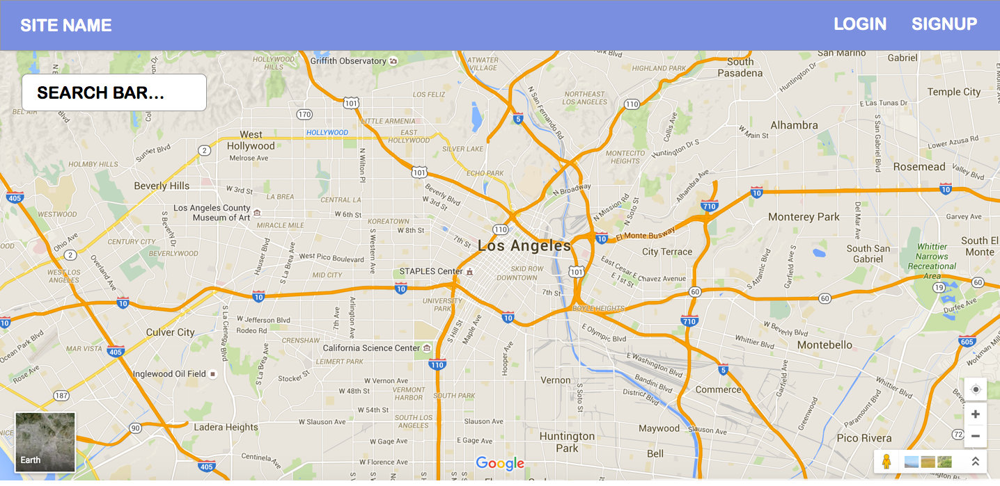
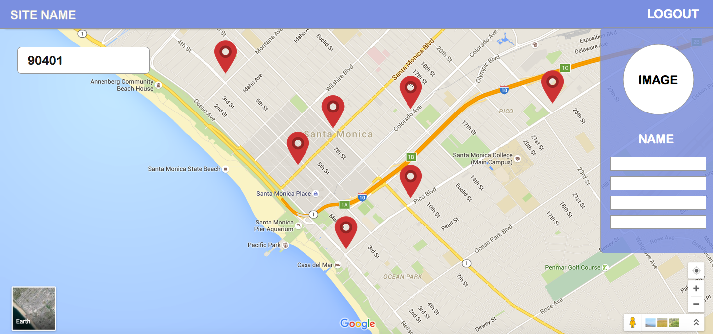
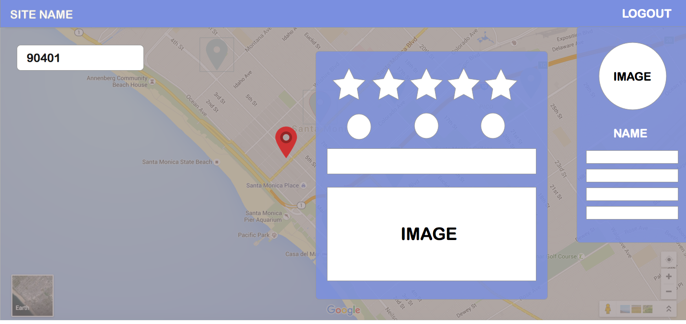

# Burrito-App!

It's like grindr...but with burritos.  The app shows you nearby burrito spots on a google maps along with its basic information(address, menu, phone number, etc).
The app also incorporates its own rating system that only members of the app can contribute to.  These rating systems include an overall rating, greasy, texmex, and artisanal. 

#### Technologies Used

* Node js

* Express

* Mongo DB

* Cookie-parser

* bcrypt-nodejs

* Google Maps API

* Zomato API

* Bootstrap

* Passport & Passport-local

#### Getting Started

If you fork this repo, you must run `npm install` in order for the app to function properly.

#### Joining the Burrito-App

Welcome to the app! You must signed up or be logged in, in order to use the app.
 

######Look Around

Once you're logged in, click on pins to see information about that restaurant such as the restaurants overall rating, as well as its greasy, texmex, and artisanal rating based on our app's users
 

 

 

######Feel free to leave a review of your own!
If you've been to that restaurant, please leave a review of your own so that other burrito lovers can benefit from your knowledge

######View Your Profile
If your logged in, click on the view your profile button on the nav bar to edit or delete your profile

